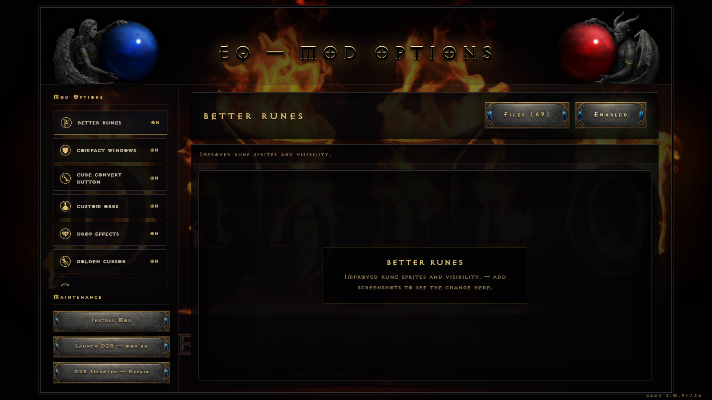
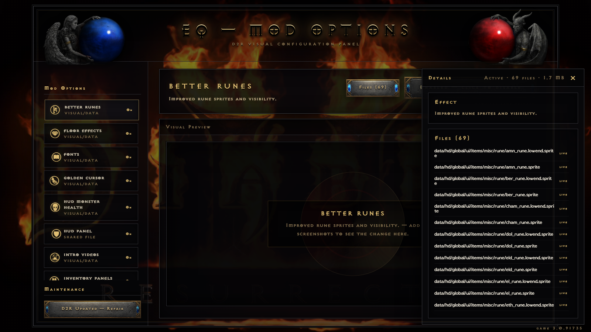

# D2rEQmod — eq Mod & Manager for Diablo II: Resurrected

A quality-of-life visual mod for D2R, with a **standalone mod manager**
that looks and feels like the game itself — live option toggles, visual
previews, one-click game-update repair, and zero external dependencies.



## The Manager

Every feature of the mod is an independent switch. Toggle it, restart
the game, done. No reinstalling, no file juggling, no guesswork.

- **16 mod options**, each owning exactly its files / string keys /
  layout nodes — options never interfere with each other (the two
  monster-health-bar options can even run at the same time)
- **Update Doctor** — when Blizzard patches the game, one click
  three-way-merges your modded layouts and strings against the old and
  new vanilla files. Deterministic and reshuffle-aware: renamed items
  carry your edits along, repurposed item codes drop stale edits
  instead of corrupting, new vanilla features (loot filter buttons,
  new tabs) always survive.
- **Install / Uninstall Mod** — writes the launch arguments into the
  Battle.net launcher config, or creates a desktop shortcut if you
  launch the game directly
- **Launch D2R** with the mod, straight from the manager
- Enabled/disabled screenshot comparison slider per option
- The whole UI is built from the game's own art: real button sprites,
  the Exocet & Blizzard fonts, the animated health/mana orb liquid in
  the header statues, the burning logo loop as the backdrop, and the
  Tristram theme one click away



## Mod options

| Option | What it does |
|---|---|
| custom-orbs | Centered health/mana globes, click-to-toggle resource bars, repositioned HUD |
| item-icons-and-nameplates | Icon glyphs and shorthand in item names, big clickable plates for high runes |
| item-info-panels | Item detail reference panels inside the inventory |
| cube-convert-button | Cube transmute button in the inventory |
| compact-windows | Slimmer open windows, side panels removed |
| npc-nameplates | NPC under-name glow, icons and styled dialog |
| monster-topbar | Custom top-of-screen monster health bar |
| overhead-healthbars | EXPERIMENTAL: console-style bars above monsters on PC |
| drop-effects | Floor/drop effects for runes, gems, keys, charms |
| coa-crown | Crown of Ages renders as a custom open-top golden crown - a unique 3D model + texture no other item shares. Companion switch **coa-crown-float**: hovers above the head or sits on it |
| better-runes, golden-cursor, waypoint-lights, trav-wall-remove, main-menu-layout, intro-videos | what it says on the tin |

## Install

1. Grab the latest release zip.
2. Put the `eq` mod folder into `<D2R>/mods/eq/eq.mpq`.
3. Unzip the manager anywhere and double-click **`EQ Mod Manager.exe`**.
   No Python, no installer, ~30 MB. The game location is auto-detected.
4. First launch pulls the background video, music, and vanilla
   baselines **from your own game install** — this download contains
   no Blizzard-owned media.
5. Toggle options, hit *Install Mod*, play with `-mod eq -txt`.

## How it works

- Binary assets (textures, sprites, videos) toggle by renaming files
  (`.bk` = dormant; the game falls back to vanilla)
- Shared string files toggle at **key level** — each option owns its
  keys and rewrites only those (English text only; other locales are
  always taken from vanilla)
- Shared layout files toggle at **node level** — each option owns
  specific widgets/variables inside the JSON
- The manager is plain Python stdlib served to your default browser
  (Edge app-mode window when available); the launcher is a 6 KB exe
- Game files are read through CascLib directly from the game's CASC
  storage — used for baselines, first-run assets, and update repair

## Building from source

```
python manager/package.py
```

Downloads the official python.org embeddable runtime, compiles the
launcher with the csc.exe that ships in Windows, and produces
`dist/EQ-Mod-Manager.zip`.

## Credits & legal

- Mod content builds on the work of the D2R modding community —
  ESP/D2RESP, yupgoolg/seonhee HUD, Better Runes, light pillars,
  waypoint lights, Golden Gauntlet cursor, and others. Credit to the
  original authors; this pack curates, merges, and makes them
  toggleable.
- CascLib by Ladislav Zezula (MIT).
- Diablo® II: Resurrected™ is a trademark of Blizzard Entertainment.
  This project is fan-made, unaffiliated, and redistributes no
  Blizzard-owned media: all game assets used by the manager UI are
  extracted at runtime from the user's own game installation.
- Screenshots above include Blizzard artwork and are shown for
  descriptive purposes.
